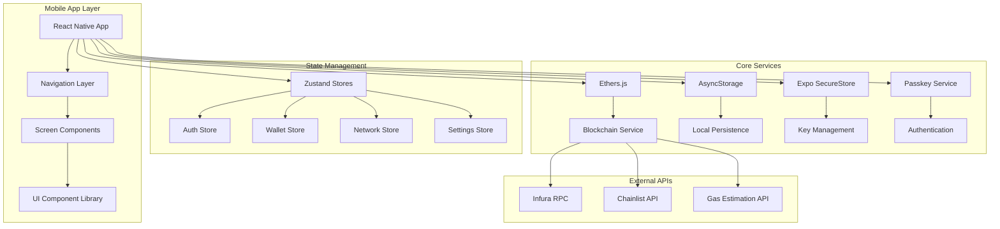
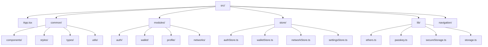
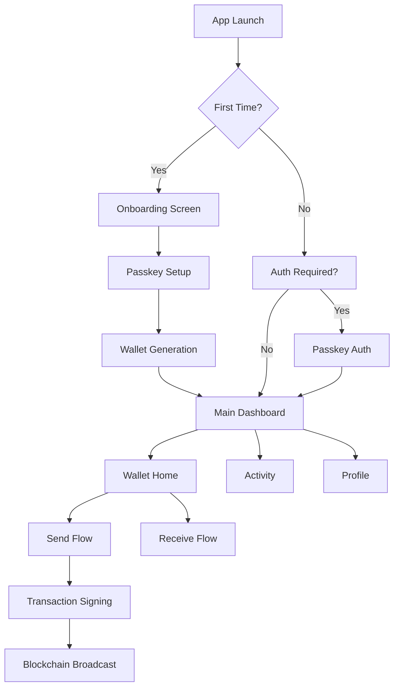
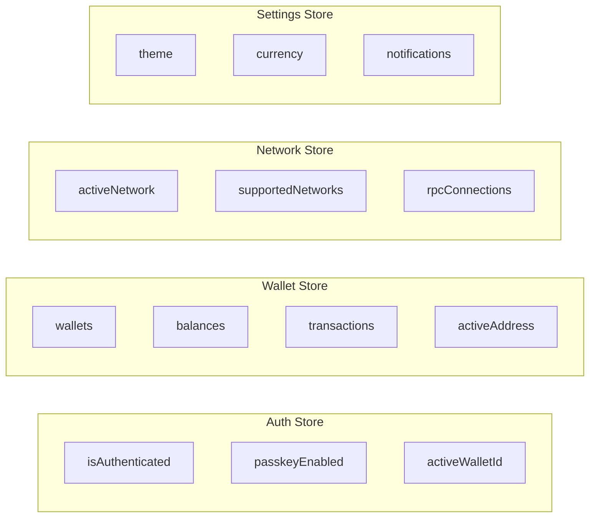
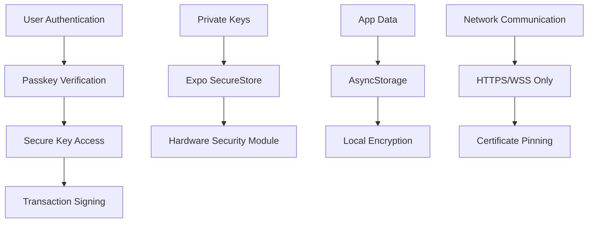
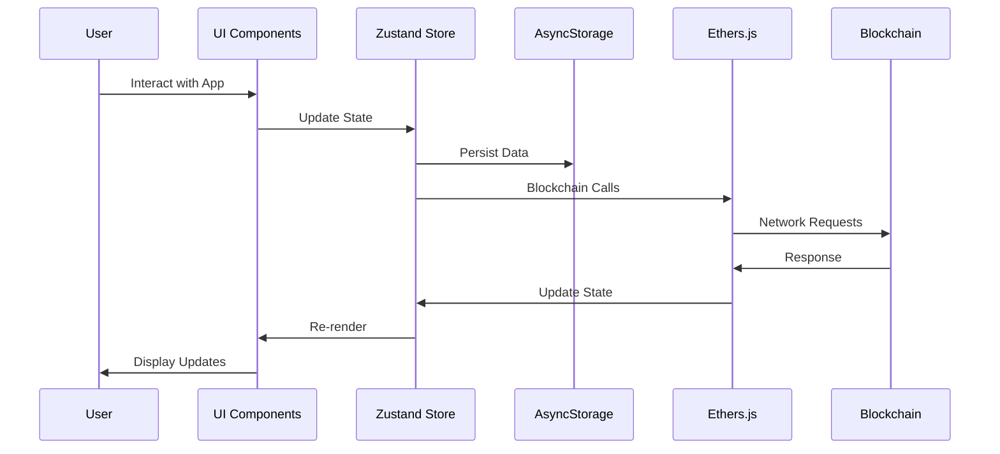

# Capsula MVP Architecture Plan

## Overview
This document outlines the comprehensive architecture plan for the Capsula mobile crypto wallet MVP, focusing on Android-first development with React Native + Expo.

## System Architecture



## Application Structure



## User Flow Architecture



## State Management Architecture



## Security Architecture



## Implementation Phases

### Phase 1: Core Foundation (MVP Priority)
1. **Project Setup & Configuration**
   - Expo TypeScript project initialization
   - Folder structure implementation
   - Development environment setup

2. **Core Infrastructure**
   - Theme system and component library
   - Navigation architecture
   - State management setup
   - AsyncStorage utilities

3. **Security & Authentication**
   - Passkey integration
   - Secure key management
   - Wallet creation/import utilities

### Phase 2: Core Wallet Features
1. **Onboarding Flow**
   - Welcome screen implementation
   - Passkey setup process
   - Wallet generation

2. **Main Wallet Interface**
   - Wallet Home screen
   - Balance display
   - Send/Receive functionality
   - Transaction history

3. **Network Management**
   - Multi-chain support (Ethereum, CELO, Gnosis)
   - Network switching
   - RPC management

### Phase 3: Enhanced Features & Polish
1. **Advanced Wallet Features**
   - Profile management
   - Multiple wallet support
   - Seed phrase export

2. **Transaction Management**
   - Gas estimation
   - Transaction status tracking
   - Push notifications

3. **Mini-App Foundation**
   - Basic framework architecture
   - SDK development preparation

## Technology Stack Details

### Core Technologies
- **React Native**: v0.72+
- **Expo**: SDK 49+
- **TypeScript**: v5.0+
- **React Navigation**: v6
- **Zustand**: v4.4+
- **Ethers.js**: v6.0+

### Key Dependencies
```json
{
  "dependencies": {
    "@react-navigation/native": "^6.1.0",
    "@react-navigation/bottom-tabs": "^6.5.0",
    "zustand": "^4.4.0",
    "ethers": "^6.0.0",
    "@react-native-async-storage/async-storage": "^1.19.0",
    "expo-secure-store": "~12.3.0",
    "expo-crypto": "~12.4.0",
    "react-native-qrcode-svg": "^6.2.0",
    "react-native-camera": "^4.2.0"
  }
}
```

### Development Tools
- **Metro Bundler**: For Android development
- **Expo CLI**: Project management
- **ESLint + Prettier**: Code quality
- **TypeScript**: Type safety

## Data Flow Architecture



## Android Build Configuration

### Development Setup
- **Target SDK**: Android 13 (API level 33)
- **Minimum SDK**: Android 7.0 (API level 24)
- **Build Tool**: Expo Application Services (EAS)
- **Testing**: Android Emulator + Physical devices

### APK Generation Process
1. Development build with Metro
2. Production build with EAS Build
3. APK optimization and signing
4. Distribution preparation

## Security Considerations

### Key Management
- Private keys stored in Expo SecureStore
- Passkey-first authentication
- Hardware security module integration
- Backup seed phrase encryption

### Network Security
- HTTPS/WSS only connections
- Certificate pinning for RPC endpoints
- Gas limit validation and warnings
- Transaction amount verification

### Data Protection
- Local data encryption
- Sensitive data segregation
- No cloud storage of private data
- Session management with timeouts

## Testing Strategy

### Unit Testing
- Component testing with Jest
- State management testing
- Utility function testing
- Crypto function validation

### Integration Testing
- Navigation flow testing
- Blockchain interaction testing
- Authentication flow testing
- Transaction flow testing

### Manual Testing
- Android device testing
- Performance validation
- Security audit checklist
- User experience validation

## Development Workflow

1. **Feature Development**: Branch-based development
2. **Code Review**: PR-based review process
3. **Testing**: Automated + manual testing
4. **Build**: EAS Build for APK generation
5. **Deployment**: APK distribution

This architecture plan provides a solid foundation for building the Capsula MVP with a focus on security, scalability, and user experience while maintaining the simplicity needed for rapid development.