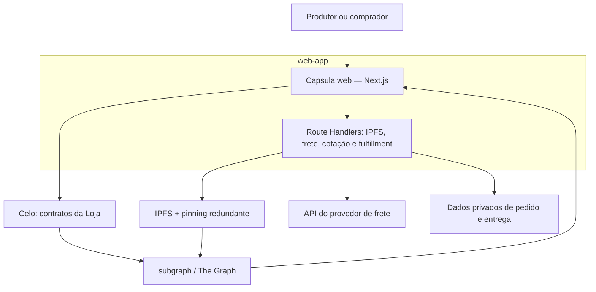
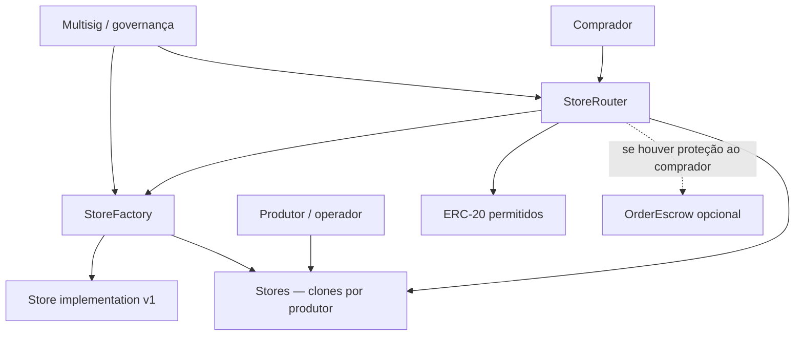
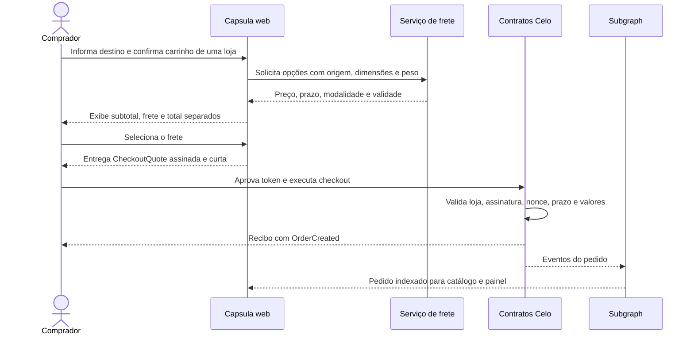

# Arquitetura da Loja — Capsula

**Status:** proposta de referência v0.1  
**Data:** 15 de julho de 2026  
**Escopo:** `web-app`, `smart-contracts` e novo pacote `subgraph`; `mobile-app` fora do escopo.

## 1. Base existente e direção proposta

O repositório Capsula já está organizado em módulos independentes gerenciados com Bun. A aplicação web usa Next.js 16, React 19, wagmi, viem e RainbowKit; os contratos usam Solidity 0.8.28, Hardhat 3 e OpenZeppelin, com implantação na Celo. A Loja deve entrar como uma nova área da aplicação web, um conjunto isolado de contratos no pacote existente e um quarto módulo independente chamado `subgraph`.

A recomendação é preservar essa estrutura:

| Pacote | Responsabilidade na Loja |
|---|---|
| `web-app` | Catálogo, página de cada loja, gestão do produtor, carrinho, checkout, pedidos e camada de servidor para IPFS, frete e cotações assinadas. |
| `smart-contracts` | Registro das lojas, configuração essencial, autorização do checkout, pagamentos e eventos canônicos. |
| `subgraph` | Indexação dos eventos da Celo e dos metadados públicos no IPFS; API GraphQL de leitura para a web. |

Não é recomendável colocar o cálculo de frete dentro de um contrato. O contrato não acessa APIs logísticas e não deve receber endereço ou CEP em texto aberto. O serviço de frete roda fora da blockchain; o resultado financeiro que ele produz é comprometido em uma cotação assinada, curta e verificável pelo contrato.

## 2. Decisões de arquitetura

### 2.1 Um pedido pertence a uma única loja

O MVP deve permitir vários itens no carrinho, porém todos da mesma loja. Um carrinho multiloja implica origens, pacotes, prazos, fretes, repasses, cancelamentos e disputas diferentes. Isso transforma um checkout em vários pedidos. A interface pode preservar o carrinho de outras lojas, mas deve finalizar uma loja por vez.

### 2.2 O frete compõe o total do pedido, não o preço permanente do produto

No catálogo, a aplicação mostra o preço do produto ou serviço. Depois que o comprador informa o destino e escolhe a modalidade de entrega, o checkout apresenta:

`total do comprador = subtotal dos itens + frete`

Se existir taxa da plataforma, a recomendação inicial é descontá-la do subtotal devido ao vendedor, sem cobrar taxa sobre o frete:

`líquido do produtor = subtotal dos itens - taxa da plataforma + frete`

Essa política precisa ser aprovada antes da implementação. Os campos devem permanecer separados no contrato e nos eventos, mesmo que a taxa inicial seja zero.

### 2.3 IPFS apenas para conteúdo público ou deliberadamente publicado

Podem ficar em IPFS público:

- perfil público da loja e do produtor;
- catálogo, descrições, imagens e políticas comerciais;
- dimensões, peso e classe logística dos produtos físicos;
- versões públicas dos termos de venda.

Não devem ficar em blockchain, subgraph ou IPFS público:

- nome civil do destinatário, quando não for deliberadamente público;
- endereço, complemento, telefone, e-mail e CEP associado a uma pessoa;
- etiquetas de envio, códigos internos do transportador e observações de entrega;
- credenciais dos serviços de frete, pinning ou assinatura.

O CID já é um identificador derivado do conteúdo. Para o MVP, armazenar `ipfs://<CID>` como `string` em estado e eventos é mais simples do que reduzir o CID a `bytes32`, pois CIDs podem usar versões, codecs e algoritmos diferentes. Uma codificação compacta só deve ser adotada após a definição de um formato único.

### 2.4 Estado essencial na Celo; projeções de leitura no The Graph

A blockchain deve conter apenas aquilo que precisa ser verificável durante uma compra: endereço da loja, administrador, conta de recebimento, signatário de checkout, status, tokens aceitos, CIDs vigentes, versão do catálogo, pagamentos e identificadores dos pedidos.

O subgraph é uma projeção de leitura. Ele pode atrasar alguns blocos e nunca deve autorizar uma operação crítica. Depois de uma transação, a web deve primeiro usar o recibo da Celo e depois aguardar a atualização do subgraph.

### 2.5 Cotação final assinada

Como o contrato não lê preços no IPFS nem consulta o transportador, o `StoreRouter` deve aceitar somente uma cotação EIP-712 válida, emitida por um `checkoutSigner` autorizado pela loja. A camada de servidor da web:

1. valida o catálogo vigente;
2. verifica disponibilidade ou reserva de estoque;
3. calcula o frete;
4. monta o total;
5. assina uma cotação de curta duração.

A assinatura autoriza uma compra específica; ela não transfere fundos. O comprador ainda aprova o token e confirma a transação na própria carteira.

## 3. Arquitetura geral



### Leitura pública

1. A web consulta lojas, versões de catálogo e pedidos públicos pelo endpoint GraphQL.
2. O subgraph indexa os eventos dos contratos e abre fontes de arquivo para os CIDs publicados.
3. A web pode usar um gateway IPFS como fallback quando um arquivo ainda não tiver sido processado pelo subgraph.

### Escrita do produtor

1. O produtor autentica a sessão com a carteira.
2. A web valida e envia o JSON e as imagens ao serviço de pinning.
3. O produtor confirma na carteira `createStore`, `setMetadataURI` ou `publishCatalog`.
4. A Celo emite eventos; o subgraph atualiza a projeção pública.

### Compra

1. A web obtém uma cotação de frete e uma cotação final assinada.
2. O comprador aprova o token e chama o `StoreRouter`.
3. O router valida loja, catálogo, token, comprador, valores, assinatura, nonce e validade.
4. O pagamento é liquidado diretamente ou enviado ao escrow, conforme a política escolhida.
5. O evento `OrderCreated` torna o pedido financeiro indexável sem expor os dados de entrega.

## 4. Contratos

### 4.1 Visão geral



Os três primeiros contratos são suficientes para cadastro, catálogo e pagamento direto. Eles não são suficientes para prometer proteção ao comprador, cancelamento forçado ou arbitragem depois que os tokens já foram transferidos ao produtor. Se essas garantias fizerem parte do produto, `OrderEscrow` deixa de ser opcional.

### 4.2 `StoreFactory`

**Responsabilidade:** criar lojas, manter o registro canônico de contratos válidos e informar ao subgraph quando surge uma nova loja.

**Desenho recomendado:** clones mínimos ERC-1167 criados a partir de uma implementação `Store` versionada. A factory deve inicializar o clone atomicamente na mesma transação. Novas versões podem alterar a implementação usada por novas lojas sem transformar todas as lojas antigas em proxies atualizáveis.

**Estado essencial:**

- implementação vigente da `Store`;
- `isStore[address]`;
- permissão para criar lojas, inicialmente por allowlist;
- administrador em multisig;
- versão da implementação usada em cada criação, emitida em evento.

**Funções principais:**

- `createStore(owner, payout, checkoutSigner, metadataURI, catalogURI, salt)`;
- `predictStoreAddress(owner, salt)`;
- `isStore(store)`;
- `setImplementation(newImplementation)` para novas lojas;
- gestão de `STORE_CREATOR_ROLE`, se a criação for curada.

**Eventos:** `StoreCreated`, `StoreImplementationUpdated`, `StoreCreatorUpdated`.

### 4.3 `Store`

**Responsabilidade:** representar a loja de um produtor e manter sua configuração verificável. A loja não deve armazenar listas extensas de produtos nem imagens.

**Estado essencial:**

- administrador e operadores;
- `payoutAddress`;
- `checkoutSigner`;
- `metadataURI`;
- `catalogURI` e `catalogVersion` monotônica;
- `active`;
- tokens aceitos pela loja.

**Funções principais:**

- `initialize(...)` com proteção contra reinicialização;
- `setMetadataURI(uri)`;
- `publishCatalog(uri, version)`;
- `setPayoutAddress(address)`;
- `setCheckoutSigner(address)`;
- `setPaymentToken(token, accepted)`;
- `setActive(bool)`;
- gestão de operadores.

**Eventos:** `MetadataUpdated`, `CatalogPublished`, `PayoutUpdated`, `CheckoutSignerUpdated`, `PaymentTokenUpdated`, `StoreStatusUpdated`, `OperatorUpdated`.

O endereço do contrato da loja deve ser seu identificador canônico. Slugs servem para navegação e busca, mas não devem substituir o endereço porque podem colidir ou mudar.

### 4.4 `StoreRouter`

**Responsabilidade:** ser o único ponto de entrada recomendado para checkout, validar a cotação e executar a liquidação. O nome `StoreRouter` é preferível a `Router`, que é genérico demais no contexto do repositório.

**Estado essencial:**

- endereço da `StoreFactory`;
- tokens globalmente permitidos;
- conta da tesouraria e regra de taxa;
- nonces ou `quoteId` já utilizados;
- pausa de emergência;
- pedidos e saldos somente se a liquidação usar escrow dentro do próprio router.

**Função central:**

`checkout(CheckoutQuote quote, bytes signature) returns (bytes32 orderId)`

Estrutura conceitual da cotação:

```solidity
struct CheckoutQuote {
    bytes32 quoteId;
    address store;
    address buyer;
    address paymentToken;
    uint256 itemsSubtotal;
    uint256 shippingAmount;
    uint256 platformFee;
    uint256 buyerTotal;
    bytes32 catalogHash;
    bytes32 cartHash;
    bytes32 fulfillmentRefHash;
    uint256 nonce;
    uint64 validUntil;
}
```

O domínio EIP-712 compromete também `chainId` e o endereço do router. O contrato deve exigir que:

- a loja tenha sido criada pela factory e esteja ativa;
- o token seja permitido globalmente e pela loja;
- `buyer == msg.sender`;
- a assinatura corresponda ao `checkoutSigner` vigente;
- a cotação não esteja vencida nem tenha sido usada;
- `buyerTotal == itemsSubtotal + shippingAmount` sob a política inicial;
- a taxa esteja de acordo com a configuração vigente;
- `catalogHash` corresponda ao catálogo vigente;
- nenhum campo financeiro tenha sido alterado.

Use `SignatureChecker` em vez de assumir apenas assinaturas EOA; isso mantém compatibilidade com carteiras contratuais ERC-1271. O pagamento deve usar `SafeERC20`, checks-effects-interactions, `ReentrancyGuard` e uma allowlist curta de tokens conhecidos.

**Eventos mínimos:**

- `OrderCreated(orderId, store, buyer, token, itemsSubtotal, shippingAmount, platformFee, buyerTotal, cartHash, fulfillmentRefHash)`;
- `OrderStatusUpdated` se o status operacional também for registrado na Celo;
- `PaymentReleased` e `OrderRefunded` apenas no modelo com escrow;
- `FeePolicyUpdated`, `PaymentTokenUpdated`, `RouterPaused`.

### 4.5 `OrderEscrow` — decisão condicionante

Este contrato é necessário quando a Capsula quiser impor on-chain qualquer uma destas garantias:

- devolução antes do envio;
- liberação depois da confirmação de recebimento;
- prazo automático para liberação;
- disputa e arbitragem;
- reembolso parcial ou integral.

Antes de escrever esse contrato é preciso definir quem pode liberar, cancelar ou arbitrar, quais são os prazos e o que ocorre com a taxa. Sem essas regras, um escrow apenas congela o conflito dentro do contrato.

Para um piloto entre produtores curados, pode-se começar com pagamento direto e comunicação explícita de que a blockchain registra o pagamento, mas não garante a entrega. Se houver promessa de proteção ao comprador, o escrow deve entrar já na v1.

### 4.6 Contratos que não são necessários na v1

- `ProductRegistry`: duplicaria em storage o catálogo já publicado em IPFS.
- `ShippingOracle`: a validação da cotação cabe no `StoreRouter`; pode ser extraída depois se surgirem vários signatários e provedores independentes.
- um contrato por produto ou NFT por pedido: acrescenta custo sem resolver frete, estoque ou entrega.
- integração automática com `GPBRVSwapper` durante o checkout: mistura slippage e compra numa única transação. Na v1, o usuário faz o swap antes e paga com o token aceito.

## 5. Fluxo de checkout



O `fulfillmentRefHash` não deve ser um hash simples do endereço ou CEP. Esses valores têm baixa entropia e podem ser testados por força bruta. Use uma referência aleatória e salteada que correlacione o pedido on-chain ao registro privado do servidor.

## 6. Distribuição dos dados

| Dado | Blockchain | IPFS público | Subgraph | Armazenamento privado |
|---|:---:|:---:|:---:|:---:|
| Endereço da Store, owner, payout, signer e status | Sim | Não | Sim | Opcional |
| Nome, descrição, imagens e categorias da loja | CID/URI | Sim | Sim, via file data source | Cache opcional |
| Produtos, serviços, preços publicados, dimensões e peso | CID/URI do catálogo | Sim | Sim, como snapshot | Cache/estoque atual |
| Estoque reservado e concorrência de checkout | Não | Não | Não | Sim |
| Comprador, token e valores pagos | Sim | Não | Sim | Sim |
| Itens exatos do pedido | Apenas `cartHash` | Não por padrão | Hash | Sim |
| CEP, endereço, telefone e etiqueta | Não | Não | Não | Sim |
| Cotação de frete | Hash, valor e validade | Não | Campos públicos do evento | Resposta completa |
| Status financeiro verificável | Sim | Não | Sim | Espelho |
| Status logístico detalhado | Opcional e agregado | Não | Se emitido | Sim |

O IPFS não garante, sozinho, disponibilidade permanente. Todo CID usado pela Loja deve ser pinado em pelo menos dois pontos independentes, e a aplicação deve monitorar a recuperação dos arquivos.

## 7. Novo pacote `subgraph`

### 7.1 Estrutura

```text
subgraph/
├── AGENTS.md
├── README.md
├── package.json
├── subgraph.yaml
├── schema.graphql
├── networks.json
├── abis/
│   ├── StoreFactory.json
│   ├── Store.json
│   └── StoreRouter.json
├── src/
│   ├── store-factory.ts
│   ├── store.ts
│   ├── store-router.ts
│   └── ipfs/
│       ├── store-metadata.ts
│       └── catalog.ts
└── tests/
```

O pacote permanece independente e usa Bun, coerente com o monorepo. Os ABIs devem ser exportados dos artefatos do Hardhat por um script; não devem ser copiados e mantidos manualmente em três lugares.

### 7.2 Fontes de dados

- `StoreFactory` é uma fonte on-chain estática.
- `StoreCreated` cria dinamicamente um template on-chain `Store` para cada clone.
- `StoreRouter` é uma fonte on-chain estática.
- `MetadataUpdated` e `CatalogPublished` criam templates `file/ipfs` para os respectivos CIDs.

As fontes de arquivo do The Graph são isoladas das entidades on-chain e geram entidades imutáveis. Portanto, a modelagem deve usar o CID como chave de ligação entre a entidade on-chain e o snapshot do arquivo.

### 7.3 Entidades sugeridas

| Entidade | Tipo | Uso |
|---|---|---|
| `Store` | mutável, on-chain | Estado atual e CIDs vigentes. |
| `Account` | mutável, on-chain | Relação entre owner, comprador e lojas. |
| `CatalogRevision` | imutável, on-chain | Histórico de versões e CIDs publicados. |
| `StoreMetadata` | imutável, arquivo IPFS | Nome, descrição, imagens e categorias. |
| `CatalogSnapshot` | imutável, arquivo IPFS | Cabeçalho e versão do catálogo. |
| `ProductSnapshot` | imutável, arquivo IPFS | Produtos e serviços pertencentes a um snapshot. |
| `Order` | mutável, on-chain | Valores, participantes, hashes e estado financeiro. |
| `OrderStatusChange` | imutável, on-chain | Linha temporal verificável do pedido. |

O catálogo deve trazer `schemaVersion`. Cada produto precisa de um `productId` estável que não dependa do nome ou slug. Versões antigas permanecem consultáveis para provar qual catálogo originou uma cotação.

## 8. Organização da `web-app`

### 8.1 Rotas públicas e do comprador

```text
app/
├── lojas/page.tsx
├── lojas/[storeAddress]/page.tsx
├── lojas/[storeAddress]/produto/[productId]/page.tsx
├── carrinho/page.tsx
├── checkout/page.tsx
├── pedidos/page.tsx
└── pedidos/[orderId]/page.tsx
```

### 8.2 Rotas do produtor

```text
app/
├── criar-loja/page.tsx
└── minha-loja/
    ├── page.tsx
    ├── catalogo/page.tsx
    ├── pedidos/page.tsx
    └── configuracoes/page.tsx
```

### 8.3 Camada de servidor no próprio pacote web

```text
app/api/
├── ipfs/store-metadata/route.ts
├── ipfs/catalog/route.ts
├── shipping/quote/route.ts
├── checkout/quote/route.ts
├── orders/[orderId]/fulfillment/route.ts
└── webhooks/shipping/route.ts
```

Esses Route Handlers formam o backend-for-frontend inicial. Eles protegem credenciais, validam sessões assinadas pela carteira, aplicam rate limit, acessam o registro privado de pedidos e mantêm adaptadores de frete. Se o volume justificar, essa camada pode ser extraída mais tarde sem alterar os contratos.

Bibliotecas internas sugeridas:

```text
lib/store/
├── contracts.ts
├── subgraph.ts
├── ipfs.ts
├── catalog-schema.ts
├── shipping/
│   ├── types.ts
│   └── provider.ts
└── checkout/
    ├── quote.ts
    └── typed-data.ts
```

As páginas de catálogo podem ser Server Components. Formulários que usam carteira continuam como componentes client, seguindo o padrão atual do repositório. Toda nova mensagem deve entrar nos arquivos tipados de i18n em `pt-BR` e `en`, e a navegação deve ganhar a chave `nav.store`.

## 9. Segurança e limites operacionais

- Começar com um único token conhecido, preferencialmente GPBRV se essa for a decisão comercial; ampliar a allowlist somente depois dos testes.
- Não aceitar tokens com taxa de transferência ou comportamento rebase sem suporte explícito.
- Manter chave de pinning e chave de cotação somente no servidor; nunca usar prefixo `NEXT_PUBLIC_`.
- Usar cotação vinculada a comprador, loja, router, rede, catálogo, carrinho, nonce e validade.
- Impedir replay e permitir revogação ou rotação do `checkoutSigner`.
- Usar `Pausable`, `ReentrancyGuard`, `SafeERC20` e `SignatureChecker` nas fronteiras apropriadas.
- Colocar administração da factory/router em multisig, não em uma chave pessoal isolada.
- Preferir contratos imutáveis e implantações versionadas. Proxies atualizáveis só devem entrar com justificativa e governança explícita.
- Inicializar clones atomicamente; clones não inicializados podem ser tomados por terceiros.
- Validar JSON por esquema antes do pinning e limitar tamanho, tipo e quantidade de mídia.
- Não tratar o subgraph como fonte de autorização ou de confirmação final de pagamento.
- Fazer auditoria independente antes de manter fundos em escrow em produção.

## 10. Testes mínimos

### Contratos

- criação determinística, inicialização atômica e registro de clones;
- autorização de owner, operador e administrador;
- monotonicidade de `catalogVersion`;
- quote válida e todas as mutações inválidas de seus campos;
- assinatura errada, contrato ERC-1271, nonce repetido, expiração e rede errada;
- loja pausada, token não permitido e catálogo trocado;
- arredondamento da taxa e tokens com 6 e 18 casas;
- reentrância, transferências que falham e pausa de emergência;
- pagamento direto ou todos os caminhos de release/refund do escrow;
- teste live no fork da Celo com o token real escolhido.

### Subgraph

- criação da entidade `Store` e do template dinâmico;
- atualização de CIDs e preservação de revisões;
- parsing de metadados e catálogo IPFS;
- criação e atualização de pedidos;
- CIDs ausentes ou JSON inválido sem corromper as entidades on-chain.

### Web

- carrinho restrito a uma loja por checkout;
- produtos físicos, serviços e carrinho misto;
- frete indisponível, cotação vencida e mudança de catálogo;
- recuperação após transação confirmada e subgraph atrasado;
- proteção das rotas do produtor e do fulfillment;
- ausência de dados pessoais em logs, URLs, eventos e IPFS.

## 11. Fases de implementação

### Fase 0 — decisões e esquemas

Fechar forma de liquidação, token inicial, taxa, permissão para criar loja, política de estoque, provedor de frete, regras de cancelamento e schemas JSON. Produzir ADRs curtas antes do Solidity.

### Fase 1 — contratos

Implementar interfaces, `Store`, `StoreFactory`, `StoreRouter`, módulo Ignition, unit tests e live tests no fork da Celo. O escrow só entra depois de sua política estar formalizada.

### Fase 2 — subgraph

Criar o pacote, exportar ABIs, modelar entidades, indexar factory/router, usar template dinâmico para stores e fontes `file/ipfs` para os metadados. Testar no Subgraph Studio e depois publicar.

### Fase 3 — gestão da loja

Criar autenticação por carteira, pinning, criação da loja, edição do perfil, publicação de catálogo e painel de pedidos.

### Fase 4 — catálogo e checkout

Criar catálogo de lojas/produtores, página individual, produto/serviço, carrinho, frete, cotação assinada, aprovação e compra.

### Fase 5 — produção

Adicionar observabilidade, pinning redundante, rate limiting, webhooks idempotentes, política de chaves, multisig, auditoria e plano de resposta a incidentes.

## 12. Decisões que ainda precisam de aprovação

| Decisão | Padrão recomendado para o piloto |
|---|---|
| Token de pagamento | GPBRV apenas; swaps ocorrem antes do checkout. |
| Carrinho multiloja | Não; um pedido e um frete por loja. |
| Criação de loja | Curada por `STORE_CREATOR_ROLE`. |
| Liquidação | Direta apenas se não houver promessa de proteção; caso contrário, escrow desde a v1. |
| Taxa | Zero inicialmente ou descontada apenas do subtotal, nunca do frete. |
| Estoque | Reserva privada de curta duração antes de assinar a quote. |
| Identificador público | Endereço da Store; slug apenas como alias. |
| Atualização dos contratos | Implantações versionadas e clones imutáveis. |
| Dados de entrega | Registro privado, com referência aleatória comprometida on-chain. |

Também é necessário completar a definição funcional da “página” mencionada de forma interrompida no briefing. Esta proposta assume uma página individual por loja/produtor e uma página por produto ou serviço.

## 13. Alterações documentais no repositório quando a implementação começar

- adicionar `subgraph` à tabela do `README.md` raiz;
- adicionar o módulo e sua regra de contexto ao `AGENTS.md` raiz;
- criar `subgraph/README.md` e `subgraph/AGENTS.md`;
- documentar rotas, variáveis e i18n da Loja em `web-app/README.md` e `web-app/AGENTS.md`;
- documentar contratos, comandos, eventos, deploys e testes em `smart-contracts/README.MD` e `smart-contracts/AGENTS.md`.

## Referências técnicas

- [Capsula — README](https://github.com/greenpillbr/capsula/blob/main/README.md)
- [Capsula — AGENTS raiz](https://github.com/greenpillbr/capsula/blob/main/AGENTS.md)
- [Capsula web — AGENTS](https://github.com/greenpillbr/capsula/blob/main/web-app/AGENTS.md)
- [Capsula smart contracts — AGENTS](https://github.com/greenpillbr/capsula/blob/main/smart-contracts/AGENTS.md)
- [The Graph — Subgraph Manifest](https://thegraph.com/docs/en/subgraphs/developing/creating/subgraph-manifest/)
- [The Graph — Dynamic e IPFS File Data Sources](https://thegraph.com/docs/en/subgraphs/developing/creating/advanced/)
- [The Graph — redes suportadas, incluindo Celo](https://thegraph.com/docs/en/supported-networks/)
- [OpenZeppelin — ERC-1167 Clones](https://docs.openzeppelin.com/contracts/5.x/api/proxy)
- [OpenZeppelin — EIP-712 e SignatureChecker](https://docs.openzeppelin.com/contracts/5.x/api/utils/cryptography)
- [IPFS — privacidade e criptografia](https://docs.ipfs.tech/concepts/privacy-and-encryption/)
- [IPFS — persistência e pinning](https://docs.ipfs.tech/concepts/persistence/)
- [Next.js — Route Handlers](https://nextjs.org/docs/app/getting-started/route-handlers)
