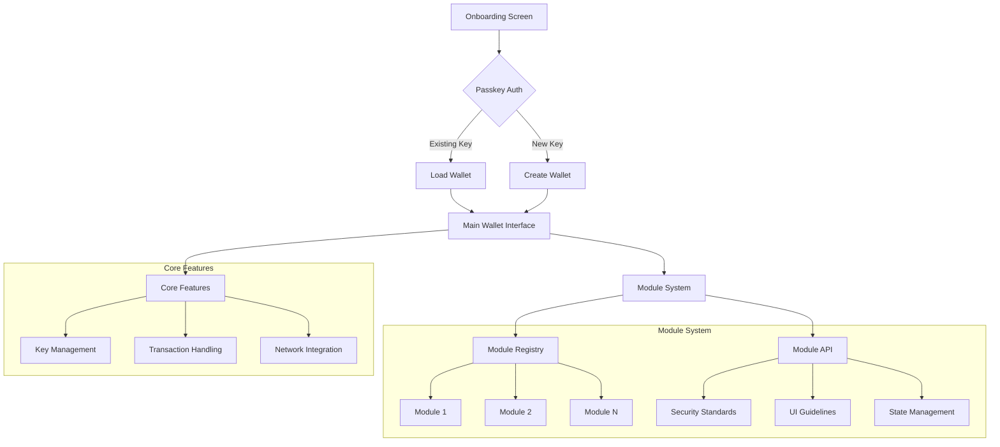

# Capsula Wallet Architecture

## Key Components

### 1. Passkey Authentication
- Single entry point for all users
- Automatic detection of existing keys
- Seamless creation of new keys
- Biometric security integration

### 2. Core Wallet
- Minimalist interface
- Focus on essential functionality
- Secure key management
- Transaction handling

### 3. Module System
- Standardized API for extensions
- Security sandboxing
- Consistent UI/UX guidelines
- State management patterns

### 4. UI/UX Principles
- Single-screen focused
- Progressive disclosure
- Clear feedback loops
- Accessibility first

## User Flow

1. User arrives at onboarding screen
2. Clicks "Continue with Passkey"
3. System automatically:
   - Checks for existing keys
   - Creates new key if needed
4. User enters main wallet interface
5. Can discover and install modules

## Module Development Guidelines

1. Security Requirements
   - Isolated state
   - Limited permissions
   - Secure communication

2. UI Components
   - Consistent styling
   - Accessibility support
   - Responsive design

3. Integration Points
   - Wallet state access
   - Transaction hooks
   - UI extension slots