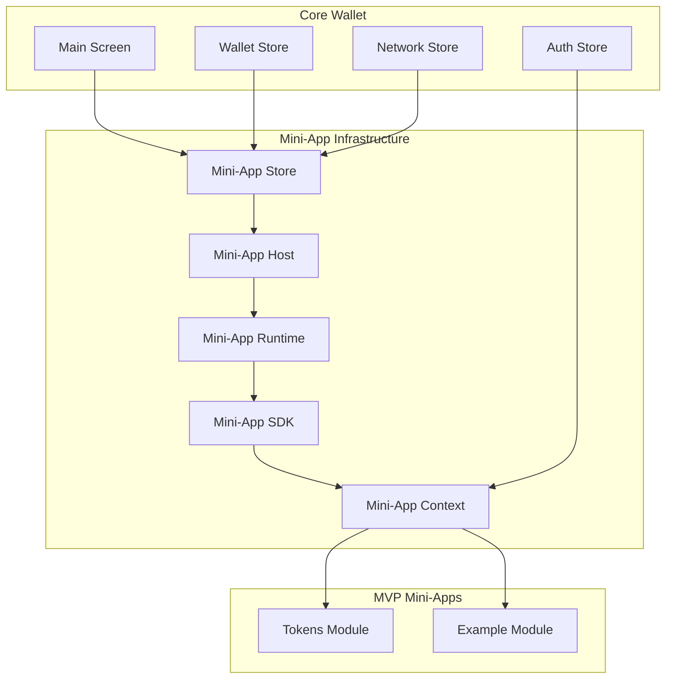

# Mini-App System MVP Architecture

## Overview
This document outlines the MVP implementation of Capsula's mini-app system - the "central pillar" of the application architecture. The MVP focuses on core infrastructure with Tokens and Example modules to demonstrate functionality.

## MVP Scope

### ✅ Included in MVP
- **Core Infrastructure**: Mini-app store, host, runtime, SDK
- **Tokens Module**: ERC-20 token management (add custom tokens, view balances)
- **Example Module**: Smart contract interaction demonstration for developers
- **Basic Integration**: Mini-app buttons on main screen, network filtering
- **Security**: Passkey integration for mini-app transactions

### 🔮 Future Phases
- Mini-app marketplace and finder screen
- Community following system
- Contacts and NFTs modules
- Installation management flows

## Technical Architecture



## Component Breakdown

### 1. Mini-App Store (Zustand)
- **Purpose**: Central state management for mini-apps
- **Data**: Installed mini-apps, active mini-app, mini-app configurations
- **Database Integration**: Uses existing `miniAppsTable` schema
- **Network Filtering**: Shows/hides mini-apps based on current network

### 2. Mini-App Host
- **Purpose**: Container and lifecycle management for mini-apps
- **Responsibilities**: Loading, mounting, unmounting mini-apps
- **Navigation**: Seamless integration with React Navigation
- **Error Handling**: Graceful error boundaries and fallbacks

### 3. Mini-App Runtime
- **Purpose**: Execution environment for mini-apps
- **Security**: Sandboxed execution with controlled access to wallet functions
- **Performance**: Optimized loading and memory management
- **State Isolation**: Each mini-app has isolated state

### 4. Mini-App SDK
- **Purpose**: Developer interface for building mini-apps
- **Core APIs**: Wallet access, network info, transaction signing
- **UI Components**: Pre-built components matching Capsula design system
- **TypeScript**: Full type safety and IntelliSense support

### 5. Mini-App Context
- **Purpose**: Bridge between core wallet and mini-apps
- **Wallet Access**: Secure access to wallet functions via React Context
- **Transaction Flow**: Passkey authorization for mini-app transactions
- **Network Awareness**: Automatic network switching handling

## MVP Mini-Apps

### Tokens Module
- **Features**: 
  - View ERC-20 token balances
  - Add custom tokens by contract address
  - Token transfer functionality
- **Purpose**: Demonstrates real-world utility
- **Integration**: Uses existing ethers service and wallet store

### Example Module
- **Features**:
  - Smart contract interaction demo
  - ABI-based function calls
  - UI component examples
- **Purpose**: SDK demonstration for developers
- **Documentation**: Living example of mini-app development

## Implementation Flow

1. **Foundation**: Mini-app store and basic infrastructure
2. **SDK**: Core APIs and TypeScript interfaces
3. **Host System**: Runtime and context providers
4. **Tokens Module**: First functional mini-app
5. **Example Module**: Developer demonstration
6. **Integration**: Main screen navigation and network filtering
7. **Security**: Passkey transaction authorization

## Security Model

- **Principle of Least Privilege**: Mini-apps only access required functions
- **Transaction Authorization**: All blockchain interactions require Passkey
- **State Isolation**: Mini-apps cannot access each other's data
- **Controlled APIs**: Only approved wallet functions exposed via SDK

## File Structure

```
lib/
├── stores/
│   └── miniAppStore.ts
├── mini-apps/
│   ├── sdk/
│   │   ├── index.ts
│   │   ├── types.ts
│   │   └── context.tsx
│   ├── host/
│   │   ├── MiniAppHost.tsx
│   │   └── MiniAppRuntime.tsx
│   └── modules/
│       ├── tokens/
│       │   ├── TokensModule.tsx
│       │   └── components/
│       └── example/
│           ├── ExampleModule.tsx
│           └── components/
app/
└── mini-app/
    └── [id].tsx
```

## Benefits of MVP Approach

1. **Fast Prototype**: Working mini-app system quickly
2. **Architecture Validation**: Proves the modular design works
3. **Developer Experience**: Example module shows SDK capabilities
4. **User Value**: Tokens module provides immediate utility
5. **Incremental Growth**: Foundation for future expansion

This MVP establishes the complete mini-app infrastructure while delivering immediate value through the Tokens module and providing clear development guidance through the Example module.