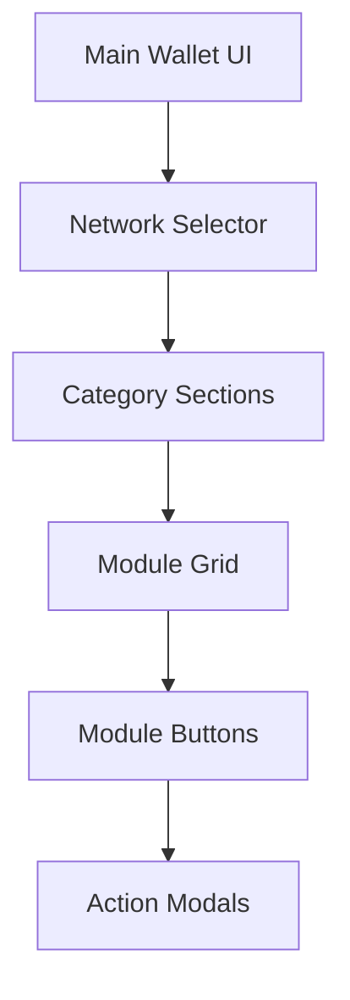
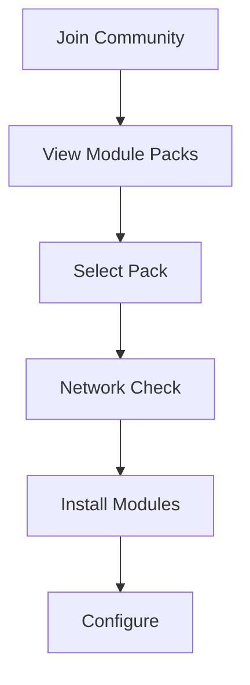

# Module System Architecture

## Overview
A flexible module system that extends wallet functionality through smart contract interactions, organized by categories and communities, with network-specific availability.

## Core Principles
- Smart contract focused: simplified blockchain interaction
- Community driven: module packs for communities
- Network aware: respect chain availability
- Mobile optimized: efficient contract interaction

## Module Categories

```typescript
enum ModuleCategory {
  DAO = 'dao',           // Governance, voting
  DeFi = 'defi',         // Staking, lending, swaps
  NFT = 'nft',           // Collections, marketplaces
  Social = 'social',     // Community features
  Identity = 'identity', // Credentials, verification
  Custom = 'custom'      // Other use cases
}

interface ModuleMetadata {
  id: string;
  name: string;
  version: string;
  category: ModuleCategory;
  description: string;
  networks: string[];    // Supported blockchain networks
  contractAddresses: Record<string, string>; // Per network
  communityId?: string;  // Associated community
}
```

## Smart Contract Integration

```typescript
interface ContractModule {
  // ABI Integration
  abi: any[];           // Contract ABI
  methods: string[];    // Available methods
  events: string[];     // Watchable events
  
  // Network Support
  networks: {
    [networkId: string]: {
      address: string;  // Contract address
      deployBlock: number; // Deployment block
      verified: boolean;   // Source verification
    }
  };
  
  // UI Components (Required)
  components: {
    icon: React.ComponentType;
    button: React.ComponentType<ModuleButtonProps>;
    modal: React.ComponentType<ModuleModalProps>;
    settings?: React.ComponentType<ModuleSettingsProps>;
  };
}
```

## Community Integration

```typescript
interface Community {
  id: string;
  name: string;
  description: string;
  modules: ModulePackage[];
  networks: string[];    // Supported networks
}

interface ModulePackage {
  id: string;
  name: string;
  modules: string[];    // Module IDs
  recommended: boolean;
  autoInstall: boolean;
}
```

## Module Interface

```typescript
interface WalletModule {
  metadata: ModuleMetadata;
  contract: ContractModule;
  
  // Required Methods
  initialize: (network: string) => Promise<void>;
  cleanup: () => Promise<void>;
  
  // Contract Interaction
  estimateGas: (method: string, params: any[]) => Promise<string>;
  call: (method: string, params: any[]) => Promise<any>;
  send: (method: string, params: any[]) => Promise<string>;
  
  // Event Handling
  subscribeToEvents: (events: string[]) => void;
  unsubscribeFromEvents: (events: string[]) => void;
}
```

## UI Integration

### Module Button
```typescript
interface ModuleButtonProps {
  onPress: () => void;
  disabled?: boolean;
  loading?: boolean;
  network: string;
  style?: ViewStyle;
}
```

### Module Modal
```typescript
interface ModuleModalProps {
  visible: boolean;
  onClose: () => void;
  network: string;
  contractState: any;
  onAction: (method: string, params: any[]) => Promise<void>;
}
```

## Network Handling

```typescript
interface NetworkSupport {
  // Network Validation
  isSupported: (networkId: string) => boolean;
  getNetworkConfig: (networkId: string) => NetworkConfig;
  
  // Network Switching
  onNetworkChange: (networkId: string) => Promise<void>;
  
  // State Management
  getContractState: () => Promise<any>;
  watchContractEvents: () => void;
}
```

## Module Layout

### Main UI Integration
```typescript
interface ModuleLayout {
  // Button Grid
  columns: number;
  spacing: number;
  groupByCategory: boolean;
  
  // Category Section
  categoryHeader: {
    height: number;
    style: ViewStyle;
  };
  
  // Network Filter
  networkSelector: {
    visible: boolean;
    style: ViewStyle;
  };
}
```

### Module Organization


## Community Features

### Module Discovery
```typescript
interface ModuleDiscovery {
  // Community Integration
  browseCommunities: () => Promise<Community[]>;
  joinCommunity: (communityId: string) => Promise<void>;
  
  // Module Packs
  getRecommendedPacks: () => Promise<ModulePackage[]>;
  installPack: (packageId: string) => Promise<void>;
}
```

### Installation Flow


## Smart Contract Interaction

### Method Handling
```typescript
interface ContractMethod {
  name: string;
  inputs: ABIParameter[];
  outputs: ABIParameter[];
  stateMutability: 'view' | 'nonpayable' | 'payable';
  
  // UI Helpers
  getInputForm: () => React.ReactNode;
  validateInputs: (params: any[]) => boolean;
  formatOutput: (result: any) => any;
}
```

### Transaction Flow
```typescript
interface TransactionFlow {
  // Pre-transaction
  validateNetwork: () => Promise<boolean>;
  estimateGas: () => Promise<string>;
  
  // Transaction
  buildTransaction: () => Promise<any>;
  signTransaction: () => Promise<string>;
  
  // Post-transaction
  waitConfirmation: () => Promise<void>;
  updateUI: () => void;
}
```

## Development Guidelines

### Smart Contract Integration
1. ABI Handling
   - Validate ABI format
   - Generate type definitions
   - Document methods
   - Handle events

2. Network Support
   - Check deployment status
   - Verify source code
   - Handle network switching
   - Monitor gas prices

3. UI Requirements
   - Clear action buttons
   - Transaction feedback
   - Error handling
   - Loading states

### Module Testing
```typescript
interface ModuleTests {
  // Contract Tests
  methods: () => void;
  events: () => void;
  
  // Network Tests
  multiNetwork: () => void;
  networkSwitch: () => void;
  
  // UI Tests
  rendering: () => void;
  interaction: () => void;
  
  // Integration Tests
  community: () => void;
  discovery: () => void;
}
```

This module system provides a structured way to extend wallet functionality through smart contract interactions while maintaining a consistent mobile-first user experience and supporting community-driven module discovery.