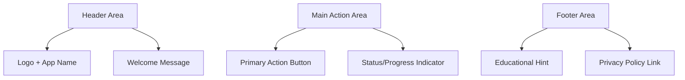

# Onboarding Screen Design

## Core Principles
- Single screen approach
- Adaptive authentication (Passkey or Transaction Password)
- Clear, minimal UI
- Support for recovery flow

## Layout Structure



## UI Components

### Header Section
- Centered logo with app name
- Welcoming message that emphasizes security
- Clean, minimal styling

### Main Action Area
- Adaptive primary button:
  - "Continue with Passkey" (when biometrics available)
  - "Create/Restore Wallet" (when biometrics unavailable)
- Clear loading states
- Success/error feedback built into button

### Footer Section
- Educational hint about security
- Minimal legal links
- Light, unobtrusive design

## States

1. Initial State (Biometrics Available)
```
┌────────────────────────┐
│         🌱             │
│       Capsula          │
│                        │
│    Secure Web3 Wallet  │
│                        │
│  ┌──────────────────┐  │
│  │Continue with     │  │
│  │    Passkey      │  │
│  └──────────────────┘  │
│                        │
│  Secured by biometrics │
└────────────────────────┘
```

2. Initial State (Biometrics Unavailable)
```
┌────────────────────────┐
│         🌱             │
│       Capsula          │
│                        │
│    Secure Web3 Wallet  │
│                        │
│  ┌──────────────────┐  │
│  │  Create/Restore  │  │
│  │     Wallet      │  │
│  └──────────────────┘  │
│                        │
│Set transaction password│
└────────────────────────┘
```

3. Loading State
- Button transforms to progress indicator
- "Checking device capabilities..."
- "Creating wallet..."
- "Restoring wallet..."

4. Recovery Flow
- In-place mnemonic input
- Transaction password setup
- Clear validation feedback

## Authentication Flows

1. Passkey Flow (Primary)
- Check biometric availability
- Native biometric prompt
- Automatic key detection/creation
- Direct to main interface

2. Recovery Flow (Fallback)
- Mnemonic word input
- Transaction password creation
- Local password storage
- Wallet restoration

## Technical Considerations

1. Component Structure
```typescript
interface OnboardingScreenProps {
  onAuthenticated: (walletInfo?: WalletInfo) => void;
}

interface AuthenticationState {
  biometricsAvailable: boolean;
  isRecoveryMode: boolean;
  transactionPassword?: string;
}

const OnboardingScreen: React.FC<OnboardingScreenProps> = ({
  onAuthenticated
}) => {
  // Implementation
}
```

2. State Management
- Check device capabilities on load
- Handle multiple authentication methods
- Secure password storage
- Clear error boundaries

3. Accessibility
- Large touch targets
- Clear focus indicators
- Screen reader support
- High contrast support

## Error Handling

1. Common Scenarios
- No biometric hardware
- Biometrics disabled
- Invalid mnemonic
- Network issues
- Key creation failures

2. Recovery Flows
- Clear error messages
- Guided recovery steps
- Password requirements
- Retry options

## Success Paths

1. Passkey Path
   a. User arrives at screen
   b. Taps "Continue with Passkey"
   c. Completes biometric auth
   d. Enters main interface

2. Recovery Path
   a. User arrives at screen
   b. Taps "Create/Restore Wallet"
   c. Enters mnemonic (if restoring)
   d. Sets transaction password
   e. Enters main interface

The design adapts to device capabilities while maintaining simplicity. When Passkey isn't available, it provides a clear alternative path using transaction passwords and mnemonic recovery, ensuring users can always access their wallets securely.