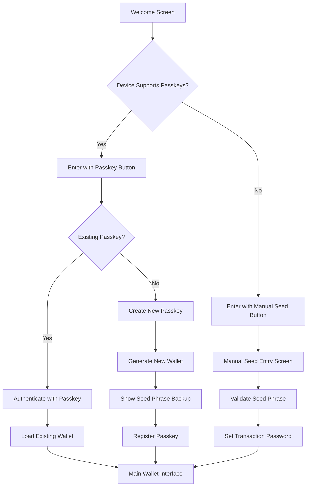
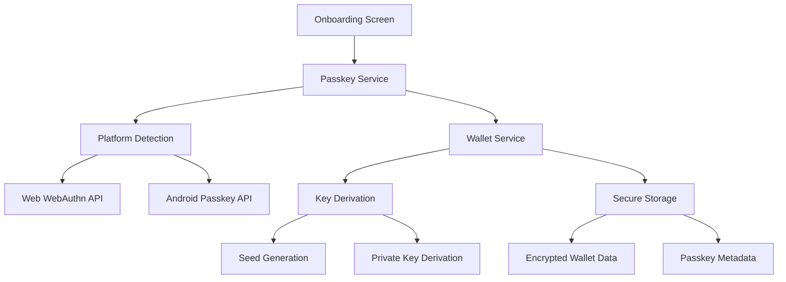

# Passkey Authentication Architecture

## New Onboarding Flow

## Technical Architecture

## Key Components

### 1. Passkey Service
- Cross-platform abstraction layer
- Device capability detection
- Passkey registration and authentication
- Error handling and fallbacks

### 2. Simplified Onboarding
- Single welcome screen
- Two primary actions: Passkey or Manual
- Progressive disclosure of complexity
- Clear error states and recovery

### 3. Security Model
- Client-side only implementation
- Passkey-derived encryption keys
- Seed phrase backup as recovery method
- No server dependencies

### 4. Platform Support
- Web: WebAuthn API
- Android: Android Passkey API
- Consistent UX across platforms
- Graceful degradation for unsupported devices