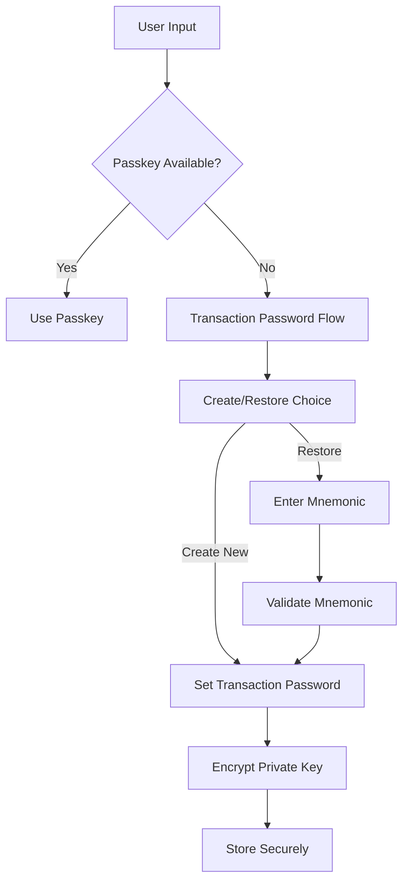
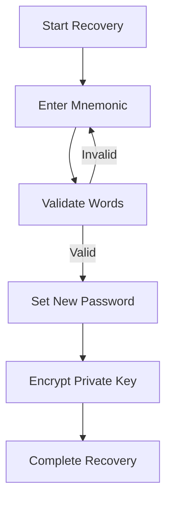

# Transaction Password System

## Overview
A secure fallback authentication system when Passkey/biometric authentication is unavailable. The system should be simple to use on mobile devices while maintaining high security standards.

## Core Requirements
- Easy to input on mobile devices
- Secure storage of password hash
- Clear recovery mechanism
- Integration with mnemonic backup

## Password System Design



## Password Requirements
- Minimum 6 characters
- Mix of numbers and letters
- No sequential numbers
- No common patterns
- Case-sensitive

## Mobile-Optimized Input
- Large number pad for PIN entry
- Clear visual feedback
- Haptic feedback on input
- Show/hide password toggle
- Clear error states

## Security Measures

1. Password Storage
   - Argon2 password hashing
   - Salt per user
   - Secure key derivation
   - Local-only storage

2. Rate Limiting
   - Progressive delays
   - Maximum attempts
   - Temporary lockouts

3. Memory Protection
   - Clear clipboard after paste
   - Prevent screenshots
   - Secure input field

## Recovery Flow

1. Mnemonic Recovery


2. Recovery Guidelines
   - Word-by-word validation
   - Autocomplete suggestions
   - Clear error messages
   - Progress indication

## Mobile UI Components

### Password Creation Screen
```
┌────────────────────────┐
│   Set Transaction      │
│      Password         │
│                        │
│  ┌──────────────────┐  │
│  │ ●●●●●●           │  │
│  └──────────────────┘  │
│                        │
│  [1] [2] [3] [4] [5]  │
│  [6] [7] [8] [9] [0]  │
│      [Clear] [⌫]      │
│                        │
│  Password Requirements │
│  • Min 6 characters    │
│  • Include numbers     │
│  • No sequences        │
└────────────────────────┘
```

### Recovery Screen
```
┌────────────────────────┐
│   Restore Wallet       │
│                        │
│  Word 1 of 12          │
│  ┌──────────────────┐  │
│  │ ab               │  │
│  └──────────────────┘  │
│                        │
│  Suggestions:          │
│  • abandon            │
│  • ability           │
│  • able              │
│                        │
│  [Previous] [Next]     │
└────────────────────────┘
```

## Implementation Guidelines

1. Password Validation
```typescript
interface PasswordValidation {
  minLength: number;
  requireNumbers: boolean;
  requireLetters: boolean;
  preventSequential: boolean;
  preventCommon: boolean;
}

interface PasswordStrength {
  score: number;        // 0-100
  feedback: string[];   // User guidance
  isValid: boolean;     // Meets requirements
}
```

2. Recovery Validation
```typescript
interface MnemonicValidation {
  wordCount: number;
  language: string;
  validateWord: (word: string) => boolean;
  suggestWords: (partial: string) => string[];
  validatePhrase: (phrase: string[]) => boolean;
}
```

3. Storage Interface
```typescript
interface SecureStorage {
  storePassword: (hash: string) => Promise<void>;
  verifyPassword: (password: string) => Promise<boolean>;
  clearStorage: () => Promise<void>;
  updatePassword: (oldHash: string, newHash: string) => Promise<void>;
}
```

## Error Handling

1. Password Errors
   - Invalid format
   - Common password
   - Sequential numbers
   - Too short/simple

2. Recovery Errors
   - Invalid word
   - Incorrect order
   - Checksum failure
   - Network issues

3. Storage Errors
   - Encryption failure
   - Storage full
   - Access denied

## Security Considerations

1. Local Storage
   - Use secure enclave when available
   - Encrypt all sensitive data
   - Clear memory after use

2. Input Protection
   - Prevent keyboard logging
   - Secure input fields
   - Clear clipboard

3. Recovery Protection
   - Rate limit attempts
   - Prevent brute force
   - Secure word suggestions

This system provides a secure and user-friendly fallback when Passkey authentication is unavailable, while maintaining high security standards and a mobile-first design approach.